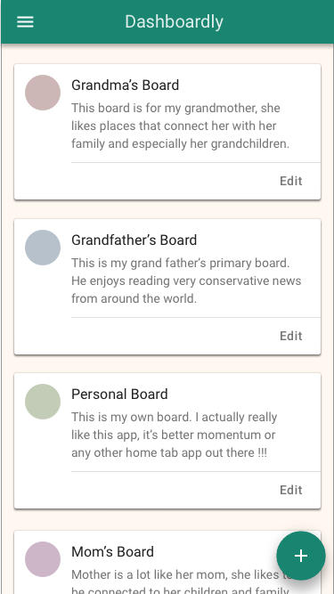
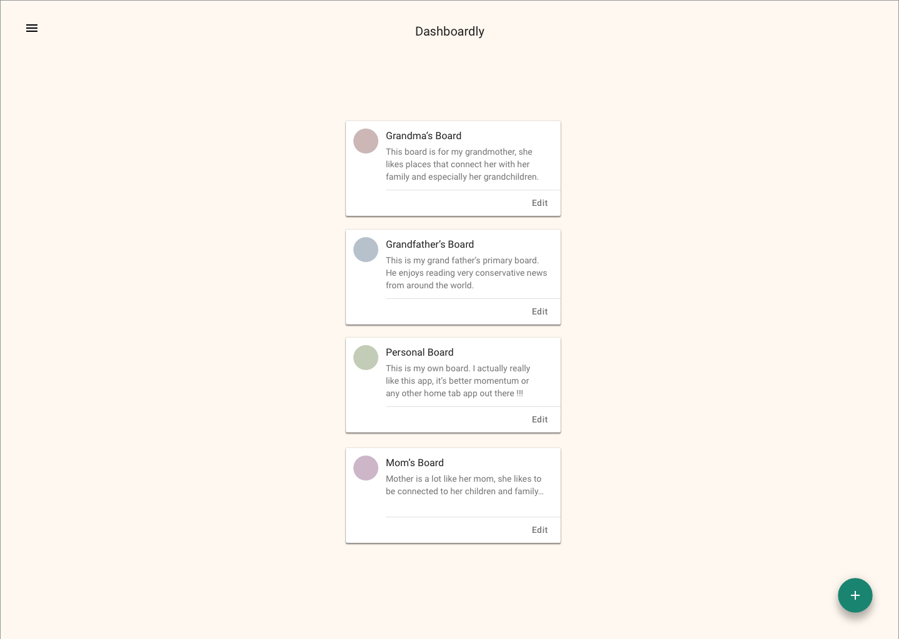
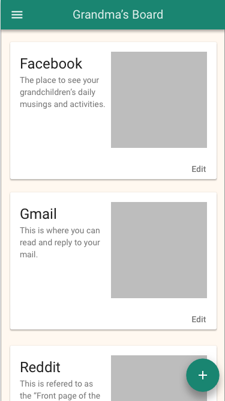
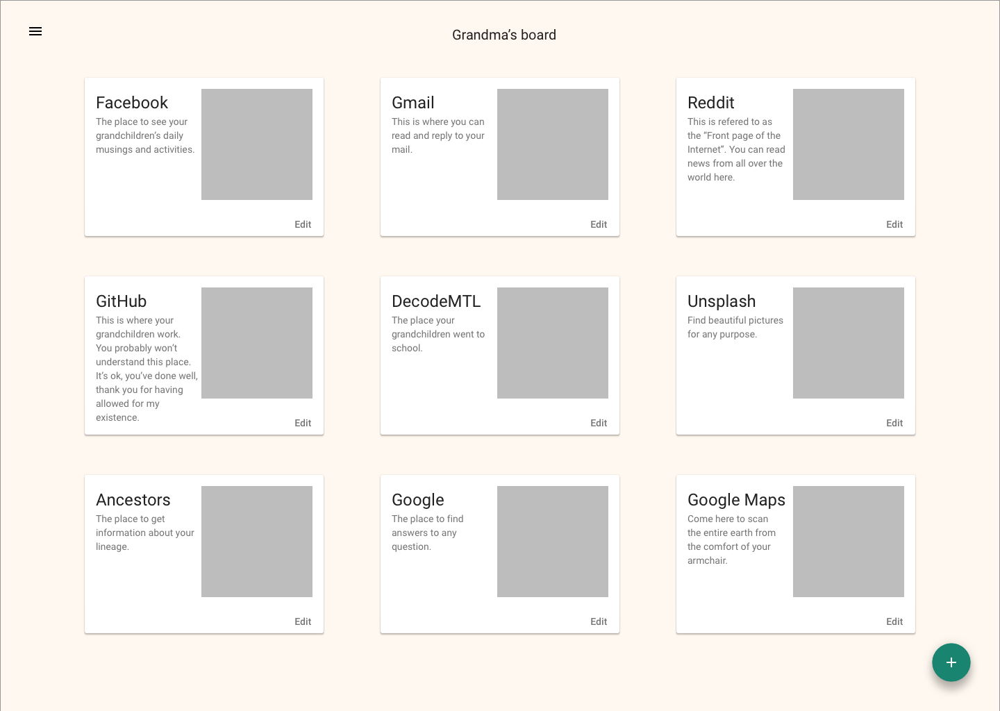
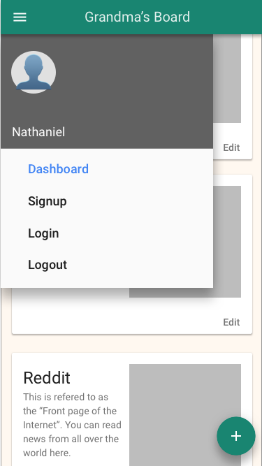
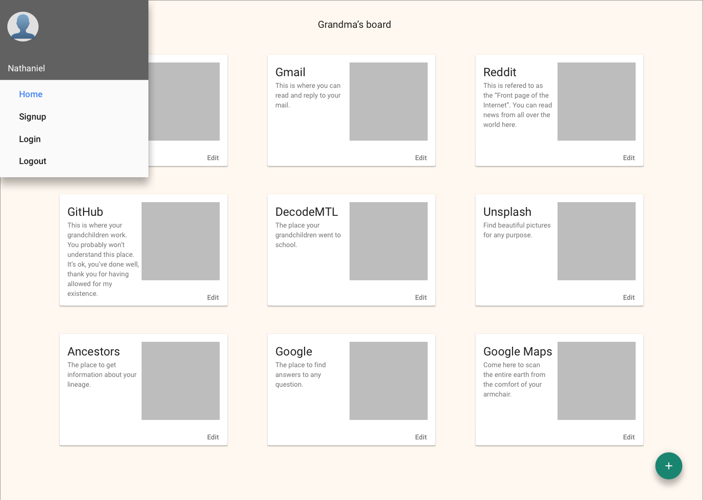
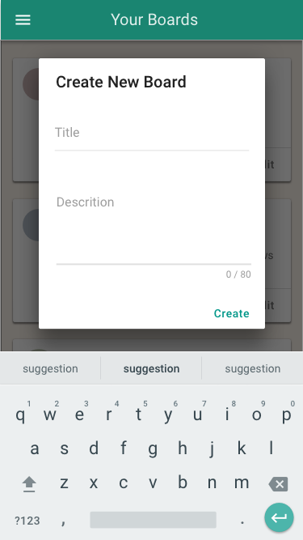
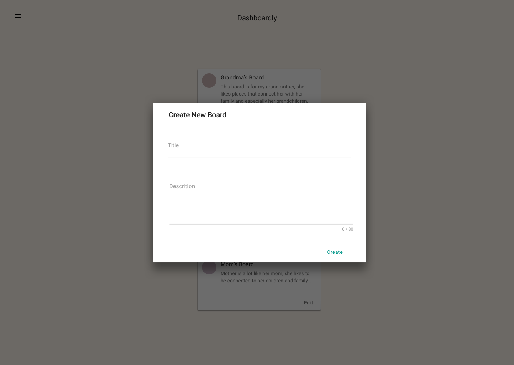
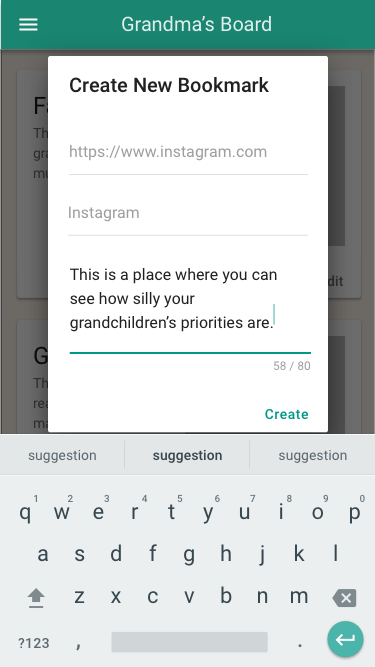
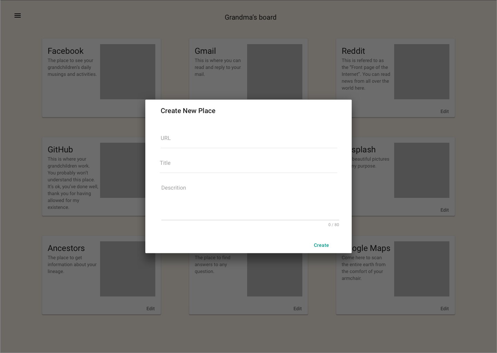

# DecodeMTL full-stack practice project: Dashboardly!

## Introduction
Here's the situation:

Dashboardly hired a senior full-stack developer to build their grand-parents dashboard application. The dude started building the API, database and front-end in parallel, but got hit by a bus midway through. You are his succession. You have been tasked with completing the missing code to create the MVP for the app, then implementing one by one a set of features to make the app better.

To help you complete your work successfully, Dashboardly has done three things for you:

1. Provided a set of mockups of what the application should look like.
2. Written document describing all the missing code to make the MVP work, as well as an explanation of each feature they want to build (attached)
3. Hired three experienced consultants (mentors) who are really good at giving hints, but cannot type due to having lost their hands in a crocodile fight

Your task is to bring the project forward as much as possible for Friday, which was announced as the official launch date for Dashboardly a year ago.

Apart from this time constraint, your other constraint is money. These consultants are :moneybag:uper expensive, and you are only allowed **25 credits** per team. Each credit gives you a **15-minute slot** with a mentor and you cannot take more than one slot per hour. A credit is all or nothing: if you use mentor time for only three minutes, you have consumed a credit.

---

## Mockups

### Home Page (displays all boards)

#### Mobile

#### Desktop

### Board Page (displays a single board)

#### Mobile

#### Desktop

### Menu (view of the opened menu)

#### Mobile

#### Desktop

### Create a board modal

#### Mobile

#### Desktop

### Create a bookmark modal

#### Mobile

#### Desktop

---

## Document from Dashboardly
This document outlines what is currently missing to make the MVP 100% functional.

TODO.